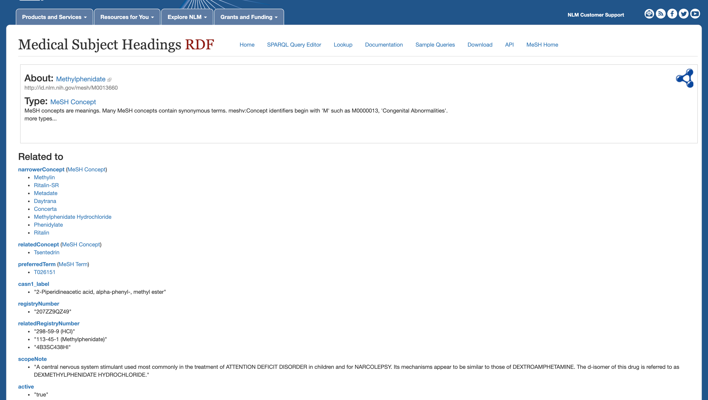

class: center middle

```{r xaringan-themer, include = FALSE, warning=FALSE}
library(xaringanthemer)
style_duo_accent(
  primary_color = "#1E4959",
  secondary_color = "#078C8C",
  inverse_header_color = "#FFFFFF",
  header_font_google = google_font("Josefin Sans"),
  text_font_google   = google_font("Montserrat", "300", "300i"),
  code_font_google   = google_font("Droid Mono"),
)
```

 


---
class: center middle


---
class: center middle


---
class: center middle


---
class: inverse center middle


???
If you've ever had to specific details on a drug, for a example, methylfenidate aka ritalin, you've probably visited either the National Library of Medicine, a drug database like Drug Bank, or if you're drug in question is illicit, then the DEA. 

---
class: split-50 center middle

.row[
.content[
]
]

.row[
.content[]
]


???
If you have, then you probably understand that each source is not only missing key pieces of information you need but are sometimes contradictory of each other!

---
# DOPE

.left-column[
</br>
</br>
<b>D</b>rug  

--

<b>O</b>ntology  

--

<b>P</b>arsing  

--

<b>E</b>ngine  ]


.right-column[


]

???
Enter DOPE!
The frustration that came with searching these sites for specific bits of information like what are the street names for Ritalin or what class of drugs does Ritalin belong to? Eventually motivated the development of DOPE. The Drug Ontology Parsing Engine. An R package designed to not only provide a comprehensive database of over 4,000 drugs but also parse free text and identify known drugs.

Before I get into a brief demonstration on how DOPE functions are used, the following slides will give you a high-level overview of some of the key functions within DOPE.
---
# `DOPE::parse()`

.pull-left[
- Extract identifiable drug names from a corpus of text 
  - clinical trial  
  - social media  
  - transcriptions
  
```{r messy-text, echo=FALSE, message=FALSE, warning=FALSE}
library(DOPE)
library(dplyr)
library(stringr)
messy_data <- drug_df %>% 
  # select records that have problematic characters
  filter(str_detect(textdrug, ",|;|and|\\/|=|\\(")) %>% 
  distinct(textdrug)

knitr::kable(messy_data)
```

]
.pull-right[
```{r parse, message=FALSE, warning=FALSE}
library(DOPE)
library(dplyr)
library(stringr)

parse(messy_data$textdrug)
```

]

???
at it's core, parse is a function that takes in a corpus of text and returns known drugs. For example, this messy dataframe includes potentially problematic characters like quotations, slashes and dashes. It also contains some information that we really don't care about, like dosage and units. 

the parse functions takes in the "textdrug" vector, filters out any stopwords and then utilizes a rule-based Natural Language Processing (NLP) model to identify and extract the drugs in a phrase. Stopwords include a combination of 3 domain-independent lexicons from Julia Silge and David Robinson's tidytext package and a set of domain-specific stopwords that we have established. What we have as a result is a vector of 11 drugs!
---
# `DOPE::lookup_*()`

.pull-left[

**Single String**
```{r lookup}
lookup("speed", "dope")
```

**Compress our search results**
```{r compress-lookup}
lookup("speed", "dope") %>% 
  compress_lookup()
```
]
.pull-right[

**Get all possible synonyms of a drug**

```{r lookup-syn, message=TRUE}
lookup_syn("dope")
```

```{r lookup-syn-cat, message=TRUE}
head(lookup_syn("marijuana"),5)
```
]


???
Once you have obtained your vector of possible drugs, then it is time to look them up! DOPE contains 1 main lookup function and 2 helper functions.

lookup() can take either a vector of strings or multiple strings and looks for any possible matches in our comprehensive lookup table. 

Because some drugs belong to multiple classes and categories they can have several hundred possible synonyms! For example, there are over 500 synonyms for just heroin alone! For this reason, we have developed a helper function, compressLookup(). this function takes in a lookup table, returned by the function lookup and, by default, reduces it to just it's associated class and categories. 

Finally, what if you wanted just a vector of synonyms? we have a function for that! lookup_syn, takes in a category and returns all the possible synonyms in that category. If you accidentally type in a synonym 
the function will return a message suggesting that you try a different query instead!

one additional note, the lookup and compresslookup functions contain three additional agruments, search/compressClass, search/compressCategory and search/compressSynonym. These arguments are there to make your search results easier to work with by setting the specific column to either TRUE or FALSE. More on that can be found in the DOPE vignette.
---
class: inverse center middle

<p style="color:#FFFFFF; font-size:4rem">DEMO `r emo::ji("herb")` </p>

---
# Vision `r emo::ji("eye")`

---
class: split-25 white center
layout: false

row.white[
# The Team
]

.row[
.split-three[
.column[.content[
.center[
### Raymond Balise, PhD
#### `r fontawesome::fa("twitter", fill = "steelblue")`[@raymondbalise](https://twitter.com/raymondBalise)
]


]
.row[
<p style="color:#30728C">Assistant Professor<br>Division of Biostatistics<br> University of Miami</p>
]
]

.column[.content[
### Layla Bouzoubaa
#### `r fontawesome::fa("twitter", fill = "steelblue")` [@bouzoulay](https://twitter.com/Bouzoulay)


]
.row[
<p style="color:#30728C">Doctoral Student<br>Information Sciences<br>Drexel University</p>
]
]

.column[.content[
### Gabriel Odom, PhD
#### `r fontawesome::fa("twitter", fill = "steelblue")` [@RevDocGabriel](https://twitter.com/RevDocGabriel)

 

]
.row[
<p style="color:#30728C">Assistant Professor<br>Department of Biostatistics<br>Florida International University</p>
]
]

]]


---
# Resources & Acknowledgments

- [DEA factsheet web pages](https://www.dea.gov/factsheets)

- [DEA 2017 Drug Slang Code Words PDF](https://bit.ly/2TDDUJ2)

- [DEA 2020 Drugs of Abuse/Resource Guide](https://bit.ly/3q2F10Z)

- [DEA Controlled Substances list in the Drug Schedule Orange Book](https://bit.ly/3iN5iPi)

- [No Slang](https://www.noslang.com/drugs/dictionary)


*We are grateful to the Clinical Trials Network for the support for the CTN-0094 project. It provided support and the timeline follow back files which motivated the development of DOPE.*


---
class: inverse center middle


<p style="color:#FFFFFF; font-size:4rem">Thanks!</p>

