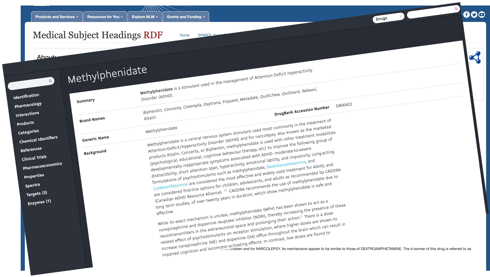

class: center middle

```{r xaringan-themer, include = FALSE, warning=FALSE}
library(xaringanthemer)
style_duo_accent(
  primary_color = "#1E4959",
  secondary_color = "#078C8C",
  inverse_header_color = "#FFFFFF",
  header_font_google = google_font("Josefin Sans"),
  text_font_google   = google_font("Montserrat", "300", "300i"),
  code_font_google   = google_font("Droid Mono"),
)
```

 


---
class: center middle



---
class: center middle


---
class: center middle


---
class: inverse center middle


???
If you've ever had to specific details on a drug, for a example, methylfenidate aka ritalin, you've probably visited either the National Library of Medicine, a drug database like Drug Bank, or if you're drug in question is illicit, then the DEA. 

---
class: split-50 center middle

.row[
.content[
]
]

.row[
.content[]
]


???
If you have, then you probably understand that each source is not only missing key pieces of information you need but are sometimes contradictory of each other!

---
# DOPE

.left-column[
</br>
</br>
<b>D</b>rug  

--

<b>O</b>ntology  

--

<b>P</b>arsing  

--

<b>E</b>ngine  ]


.right-column[


]

???
Enter DOPE!
The frustration that came with searching these sites for specific bits of information like what are the street names for Ritalin or what class of drugs does Ritalin belong to? Eventually motivated the development of DOPE. The Drug Ontology Parsing Engine. An R package designed to not only provide a comprehensive database of over 4,000 drugs but also parse free text and identify known drugs.

---
# Data Sources


???
DOPE
---
# `DOPE::parse()`

---
# `DOPE::lookup()`

---
# `DOPE::lookup_*()`

---
class: inverse center middle

DEMO `r emo::ji("herb")`

---
# Vision `r emo::ji("eye")`

---
class: split-25 white center
layout: false

row.white[
# The Team
]

.row[
.split-three[
.column[.content[
.center[
### Raymond Balise, PhD
#### `r fontawesome::fa("twitter", fill = "steelblue")`[@raymondbalise](https://twitter.com/raymondBalise)
]


]
.row[
<p style="color:#30728C">Assistant Professor<br>Division of Biostatistics<br> University of Miami</p>
]
]

.column[.content[
### Layla Bouzoubaa
#### `r fontawesome::fa("twitter", fill = "steelblue")` [@bouzoulay](https://twitter.com/Bouzoulay)


]
.row[
<p style="color:#30728C">Doctoral Student<br>Information Sciences<br>Drexel University</p>
]
]

.column[.content[
### Gabriel Odom, PhD
#### `r fontawesome::fa("twitter", fill = "steelblue")` [@RevDocGabriel](https://twitter.com/RevDocGabriel)

 

]
.row[
<p style="color:#30728C">Assistant Professor<br>Department of Biostatistics<br>Florida International University</p>
]
]

]]


---
class: inverse center middle


Thanks!